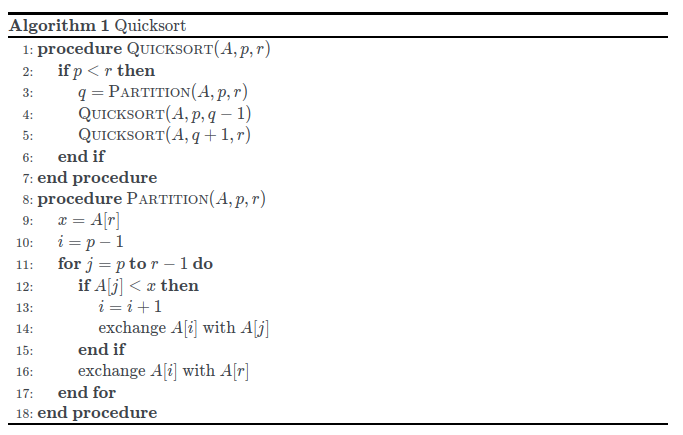

# sphinxcontrib-pseudocode

This is a [sphinx-doc](https://www.sphinx-doc.org/en/master/) extension that allows you to write LaTeX algorithm
directly inside sphinx-doc. The rendering of LaTex algorithm is powered by 
[pseudocode.js](https://github.com/SaswatPadhi/pseudocode.js).

## Demo

You can directly type LaTeX algorithm (e.g., quicksort algorithm taken from pseudocode.js demo) under ``pcode``
directive in any `.rst` files as follows:

```text
.. pcode::
   :linenos:

    % This quicksort algorithm is extracted from Chapter 7, Introduction to Algorithms (3rd edition)
    \begin{algorithm}
    \caption{Quicksort}
    \begin{algorithmic}
    \PROCEDURE{Quicksort}{$A, p, r$}
        \IF{$p < r$}
            \STATE $q = $ \CALL{Partition}{$A, p, r$}
            \STATE \CALL{Quicksort}{$A, p, q - 1$}
            \STATE \CALL{Quicksort}{$A, q + 1, r$}
        \ENDIF
    \ENDPROCEDURE
    \PROCEDURE{Partition}{$A, p, r$}
        \STATE $x = A[r]$
        \STATE $i = p - 1$
        \FOR{$j = p$ \TO $r - 1$}
            \IF{$A[j] < x$}
                \STATE $i = i + 1$
                \STATE exchange
                $A[i]$ with     $A[j]$
            \ENDIF
            \STATE exchange $A[i]$ with $A[r]$
        \ENDFOR
    \ENDPROCEDURE
    \end{algorithmic}
    \end{algorithm}
```

The above code will be rendered as 



See more examples on [demo page](https://zhu45.org/sphinxcontrib-pseudocode/).

## Installation


## Usage


## For Developer
